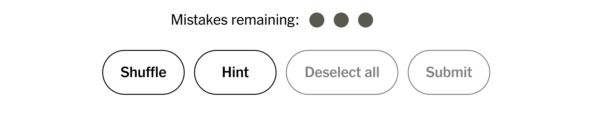
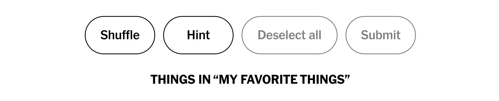
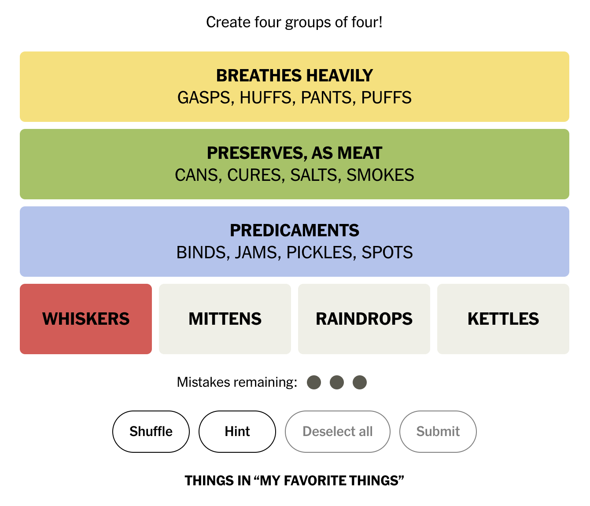

# EZ Connections
## Created by Aidan O'Hara and Dylan Sparkenbaugh

## Purpose of Project
The purpose of this project is to give users a seamless way to get help on the New York Times Connections Game. This chrome extension gives users a way to ask for hints as they solve the puzzle. After clicking the hint button for the first time, there will be a hint created that gives the user the title of the easiest category. After the first hint is given, if the user still cannot figure out the correct tiles, our program highlights a correct tile for the corresponding category.

## How the Project is Implemented
After finding the NYT api for the Connections game, we were able to load in the correct Categories and corresponding Tiles. Doing this we were able to give the most accurate hints to the Categories for the user. Then using querySelector() we were able to put the shuffle button into a variable that way we can copy its class and put it into our own button. We then placed our hint button next to the shuffle button and gave it the ability to give a hint when clicked. We created a getHint() function that runs when the hint button is clicked. In this function we checked a previously made variable  "gotPrevHint" to see if the user has previously used a hint. If they have not then we create a new text field and put the text under the buttons in a bold text. To get what the text field says we used a function called getNextHint(). In this function we use querySelectAll() to get all of the already completed categories. Doing this we were able to iterate over all of the categories and if there is a category that is not finished then the text box gets filled with a hint corresponding to that category. If we find out that the user has used a hint previously then we move to highlighting the words in the board using highlightWord(). This function takes in the category of the hint given and iterates over all of the tiles in the board and if the tile is contained in our answer array then we change the background color of the tile to red to show the user what tile to chose. Doing all of this the user can easily complete the New York Times Connections while using hints along the way.

## Demonstration of How the Extension Works

First when the extension is downloaded onto the extensions tab and the user loads in the New York Times Connections they will see the following...

They now have this hint button next to the shuffle button. 

After clicking this hint button they user is given a hint that gives them the title to the easiest missing category as shown below. 

Now they have a hint shown below the button giving them the category that they have to solve. 

If the user is still having trouble they can click the hint button again and it will highlight a tile that is contained in the category they have a hint for. 

Using all of these hints the user can now easily complete the Connections while having fun hints along the way!
